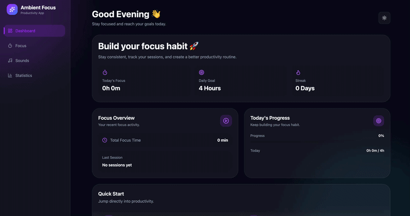

# 🌌 Ambient Focus

<p align="center">

A modern productivity application designed to improve focus, reduce distractions, and create a personalized working environment using focus sessions, ambient sounds, and productivity analytics.

</p>


<p align="center">


</p>


---

## 🌐 Live Demo

### 🚀 **Vercel Deployment**

https://ambient-focus-app.vercel.app


---

# ✨ Features

## ⏱ Focus Management

- Pomodoro-style focus sessions
- Start / Pause / Reset timer
- Automatic session tracking
- Completion notifications
- Completion sound feedback


## 🎧 Ambient Sound Mixer

- Multiple background sounds
- Independent volume control
- Real-time audio mixing
- Smooth audio transitions

## 📊 Productivity Tracking

- Daily focus goals
- Completed sessions history
- Productivity statistics
- Focus time calculation

## 🎨 User Experience

- Dark / Light mode
- Responsive design
- Modern glassmorphism UI
- Smooth animations
- Keyboard accessibility

## 💾 Data Persistence

- LocalStorage based storage
- Theme persistence
- Session history persistence

---

# 🖥️ Screenshots


## 🏠 Dashboard


## ⌛ Focus Timer


## 🎧 Ambient Sounds


## 📊 Statistics


---

# 🛠 Tech Stack

## Frontend

- React
- Vite
- Tailwind CSS
- Framer Motion

## UI & Icons

- Lucide React

## State Management

- React Context API

## Storage

- Browser LocalStorage

## Deployment

- Vercel

---

# 📁 Project Architecture


```bash
ambient-focus-app

src
│
├── assets
│   ├── sounds
│   └── screenshots
│
├── components
│   │
│   ├── audio
│   │
│   ├── dashboard
│   │
│   ├── layout
│   │
│   ├── stats
│   │
│   ├── timer
│   │
│   └── ui
│
├── context
│   ├── FocusContext
│   ├── ThemeContext
│   └── NavigationContext
│
├── hooks
│
├── utils
│
├── data
│
├── pages
│
├── App.jsx
├── index.css
└── main.jsx
```

## 🚀 Installation

### Clone repository:

```bash
git clone https://github.com/djabranemmd/ambient-focus-app
```

### Move into project:

```bash
cd ambient-focus-app
```

### Install dependencies:

```bash
npm install
```

### Start development server:

```bash
npm run dev
```

### 📦 Available Scripts:

```bash
npm run dev
```

### Start development server:

```bash
npm run build
```

### Create production build:

```bash
npm run preview
```

### Preview production build.

## 🏗 Application Architecture
```bash

User Interface
      |
      |
React Components
      |
      |
Context API
      |
      |
Custom Hooks
      |
      |
LocalStorage
```
---

## The application follows a component-based architecture with:

- Reusable UI components
- Separation between logic and presentation
- Context-based global state management
- Custom hooks for reusable behaviors

---

## 🎬 Demo:

### Add your demo GIF here:



---

## 🤝 Contributing

Contributions, issues, and feature requests are welcome.

Feel free to fork this repository and submit a pull request.

## ⭐ Support

If you like this project:

⭐ Star the repository
Share it with others
Suggest improvements

## 👨‍💻 Author

Ahmed Djabrane Mammadi

Frontend Developer passionate about building modern and interactive web applications.

## 📜 License

MIT License

Made with ❤️ for productivity and computer science students.

Thank You For Read...