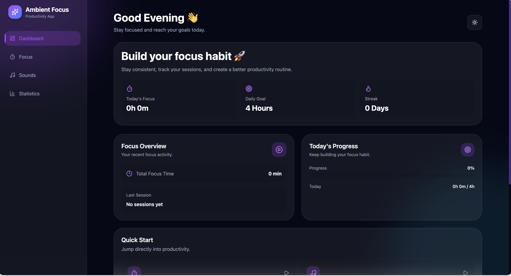
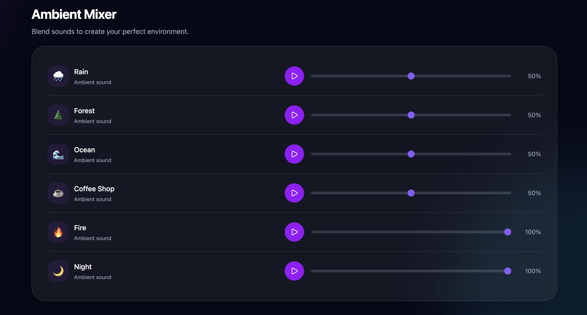
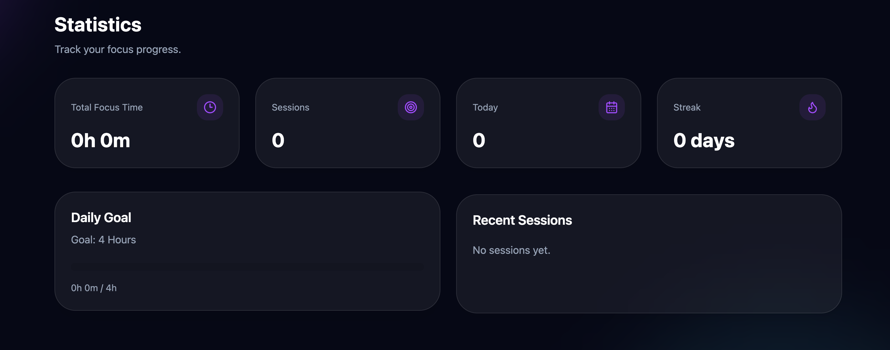

# 🌌 Ambient Focus

A modern productivity application combining focus sessions, ambient sounds, and productivity tracking.

---

## ✨ Preview

---

## 🚀 Features

- ⏱️ Pomodoro-style focus timer
- 🎵 Ambient sound mixer
- 🌙 Dark / Light mode
- 📊 Productivity statistics
- 🎯 Daily focus goals
- 🔔 Browser notifications
- 💾 Local data persistence
- 📱 Responsive design

---

## 🛠 Tech Stack

Frontend:
- React
- Vite
- Tailwind CSS
- Framer Motion

Icons:
- Lucide React

Storage:
- LocalStorage

Deployment:
- Vercel

---
## 📁 Architecture

src
│
├── assets
│   ├── sounds
│   └── ScreenShots
├── components
│   ├── dashboard
│   ├── layout
│   ├── settings
│   ├── stats
│   ├── timer
│   └── ui
│
├── context
│
├── hooks
│
├── utils
│
├── data
│
├── pages
│
├── App.css
├── App.jsx
├── index.css
└── main.jsx

---

## 🖥️ Screenshots

### 🏠 Dashboard

### ⌛️ Focus Timer

### 🎧 Sounds

### 📊 Statics

---

## 🤝 Contributing

Contributions, issues, and feature requests are welcome.

Feel free to fork the project and submit a pull request.

---

## ⭐ Support

If you find this project useful:

- Star the repository
- Share it with friends
- Suggest new Things

---

# Author

Ahmed Djabrane Mammadi
Frontend Developer passionate about building modern web experiences.

---

## 📜 License

MIT License

---

Made with ❤️ for Computer Science Students